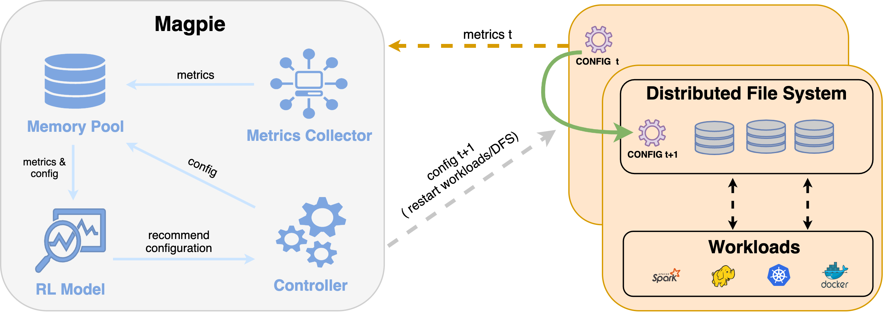

# Magpie

> A static parameter tuning system for storage
performance optimization using Deep Reinforcement Learning
(DRL).



# Environment

* Python `3.7`
* InfluxDB `2.1.1`
* Telegraf  `1.19.2`
* FileBench  `1.5-alpha3`

### Setup
1. Telegraf
   
    Telegraf is used to monitor metrics for both server and client side of DFS. You need to install telegraf on each node and configure each one according to instruction in `/telegraf`.

2. InfluxDB
   
   Install InfluxDB and fetch metrics from Telegraf.
   
3. Actor agent
   
    There is no central configuration management in Lustre and we encountered latency issues to use ssh to apply new configurations. Therefore, a simple web service is running in Lustre server to apply new configurations. You just need to start the server in each Lustre server.

    ```bash
    cd actor_agent
    pip install -r requirements.txt
    python actor_agent/server.py
    ```
4. FileBench
   
   Install FileBench and distribute workload files to servers which uses your DFS.
   ```bash
   cd fb_workload && sh sync.sh
   ```
   
5. Magpie

   update `magpie/config/pro.env` according to your environment and install the requirements.

   ```bash
   conda create magpie
   pip install -r requirements
   ```

### Run Magpie

   ```bash
   export MAGPIE_ROOT=PATH_TO_MAGPIE_REPO_FOLDER
   export PYDANTIC_ENV_FILE=${MAGPIE_ROOT}/magpie/config/pro.env
   export WORKLOAD_NAME=videoserver.f
   echo "running $WORKLOAD_NAME"
   python magpie/tuner/train.py --num-iterations 30 --dfs lustre --enable-observation-normalizer  --experiment-name video_server
   ```


### Glossary

Name|Description
---|---
DFS| Distributed File System